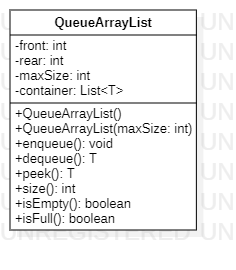

# Queue Data Structure in Java

## UML Diagram



## Repl.it

[generic-queue](https://repl.it/@alec_leong/generic-queue)

## Step 1. Compile Java Program

```
javac Main.java
```

## Step 2. Run Java Program

```
java Main
```
